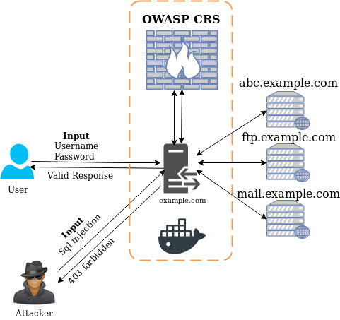

# WAF
Web application firewall for nginx reverse proxy using libmodsecurity and Owasp CRS

## 1. How it works

## 2. Dependencies
- Docker
- Optional
  - Any simple webserver (NPM or Python Webserver)
## 3. How to use
- Clone the repository using `git clone`
- Change the directory to newly cloned repo
- Build the docker image using `docker image`
```bash

#Assuming user has root privilages
#Clone the repo
$ git clone https://github.com/CurlAnalytics/WAF.git
#Change the directory "WAF"
$ cd WAF/
$ ls
#Find the Dockerfile and build image with the following command
$ docker build --tag curl-waf .
#Now using the "proxy.conf" file in the conf folder run the docker using following command
#For linux
$ docker run -v $(pwd)/conf/proxy.conf:/etc/nginx/conf.d/proxy.conf -p 80:80 --name curl curl-waf
#For Windows
$ docker.exe run -v $(pwd)\conf\proxy.conf:/etc/nginx/conf.d/proxy.conf -p 80:80 --name curl curl-waf
# From the next time start docker container as below
$ docker container start curl
```
> Note: Make changes to proxy.conf as per the network requirement.
> The name "curl" represent the container name and "curl-waf" represent the image name.

## 4. Conclusion
- Docker containers are becoming more popular and portable to use. The need of Web Application firewall reached the critical level. To make it easy to implement, we created this nginx docker container having libmodsecurity integrated with Owasp CRS. This basically acts as a web application firewall and can defend various web attacks including "OWASP top 10". If you find any difficulty kindly raise the issues along with the logs to help the community better.


Team Curl
